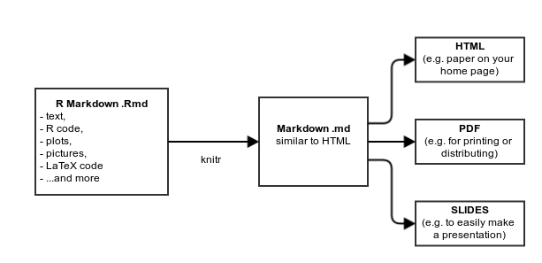

% Using R (and friends) in maths
% Paolo Masulli
% QGM Friday Lunch Seminar, 27 June 2014


# What are we talking about?

- [R](http://www.r-project.org/) is a free software programming language
- Very good for handling *data-sets*, making *plots*, *presenting results*, ...
- Easy to learn
- A LOT of packages available
- Nice IDE and editor: [RStudio](http://www.rstudio.org/)


# Quick examples


```r
x <- 1:6 # range of integers
y <- c(1,2)
x^2
```

```
## [1]  1  4  9 16 25 36
```

```r
sin(x)
```

```
## [1]  0.8415  0.9093  0.1411 -0.7568 -0.9589 -0.2794
```

```r
x+y
```

```
## [1] 2 4 4 6 6 8
```

# Did you say plots?


```r
library(ggplot2)
qplot(speed, dist, data = cars) + geom_smooth()
```

 

# Arc diagrams

We can draw arc diagrams for RNA secondary structure, defining them as parenthesized strings (e.g. ((..().)))

 


# Presenting data and results: R Markdown

- It's a plain text formatting syntax, like a simplified HTML.
- Easier than LaTeX. Far fewer commands to remember, e.g. to write bullet points, just begin with a dash "`-`" instead of `\begin{itemize}` and `\item`;
- It can include LaTeX code e.g. 
$f(k)={n \choose k}p^{k}(1-p)^{n-k}$
- It can include R code which gets executed when transforming the R Markdown into HTML/PDF/slides. (using `knitr`). It takes one click.

# Example workflow




# Example: this presentation

- This presentation was written in R Markdown.
- Let's peek at the [source code](R_in_maths.Rmd).

# Example outputs

 I can transform my presentation in different formats using [knitr](http://yihui.name/knitr/), [pandoc](http://johnmacfarlane.net/pandoc/) and other commands 
- [HTML](R_in_maths.html)
- [PDF](R_in_maths.pdf)

# Eye-candy

A different kind of plot: [pollution in the US](choropleth_county.png) (Source: Kamal, Exploratory Data Analysis Coursera class, May 2014)
